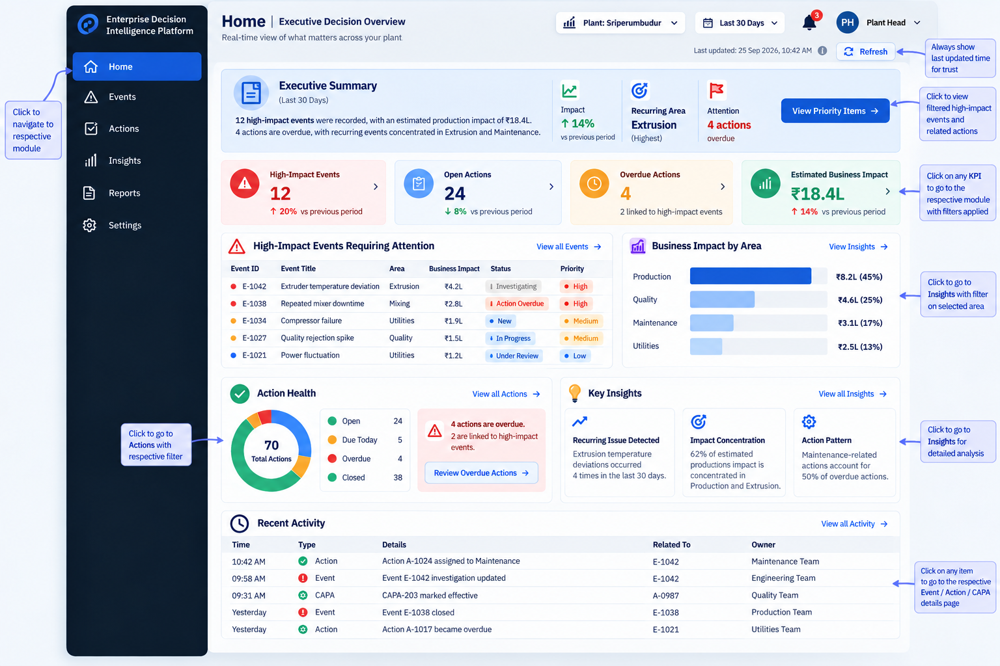

# Home — Executive Decision Overview

> **A decision-oriented view of what matters, where impact is concentrated, and what requires attention.**

## Purpose

Enable plant leadership to quickly **prioritise, assess impact, and determine where to act**.

> ### Executive Summary
>
> **12 high-impact events require attention.**
>
> Estimated business impact: **₹18.4L**  
> Overdue actions: **4**  
> Recurring concentration: **Extrusion & Maintenance**
>
> **[View Priority Items →]**

## Information Hierarchy

| Layer | Decision Question | Primary Content |
|---|---|---|
| **Executive Summary** | What is happening? | Current operating situation and key signals |
| **Priority KPIs** | What matters? | High-impact events, open actions, overdue actions, business impact |
| **High-Impact Events** | What requires attention? | Events requiring leadership visibility |
| **Business Impact** | Where is impact concentrated? | Impact by area / business dimension |
| **Action Health** | Are we responding? | Open, due, overdue and closed actions |
| **Key Insights** | What are we learning? | Recurrence, concentration and emerging patterns |
| **Recent Activity** | What has changed? | Recent events, actions and closure activity |

## Navigation

**Home → Prioritise**  
**Events → Investigate**  
**Actions → Execute**  
**Insights → Learn**  
**Reports → Communicate**  
**Settings → Govern**

> **Design Principle:** Surface the right context first; enable deeper investigation through drill-down.

**Status:** Design Baseline
