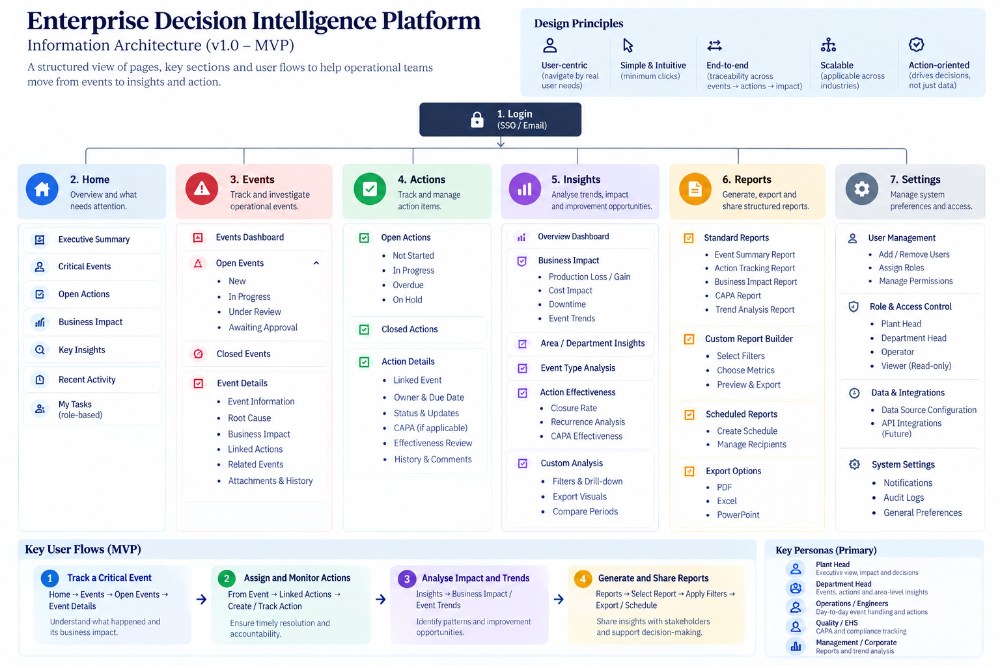

# Information Architecture — Enterprise Decision Intelligence Platform

> **A customer-centric information architecture designed to help decision-makers move from operational events to informed decisions, accountable actions, and organisational learning.**

## Purpose

This architecture defines the platform's navigation, information hierarchy, module boundaries, and core user flows.

The structure is organised around six distinct user needs:

**Home → Prioritise**  
**Events → Investigate**  
**Actions → Execute**  
**Insights → Learn**  
**Reports → Communicate**  
**Settings → Govern**

## Core Product Flow

**Event → Context → Decision → Action → Outcome → Learning**

## Design Principles

- **Customer-centric** — organised around user decisions and workflows.
- **Event-centric** — operational events form the primary investigation object.
- **Traceable** — users can move from summaries to underlying evidence.
- **Action-oriented** — insights lead toward accountable action.
- **Scalable** — architecture can extend across industries and enterprise contexts.
- **MVP-conscious** — broad architecture, focused implementation.

## Architecture

> **Status:** Information Architecture — Working Baseline
